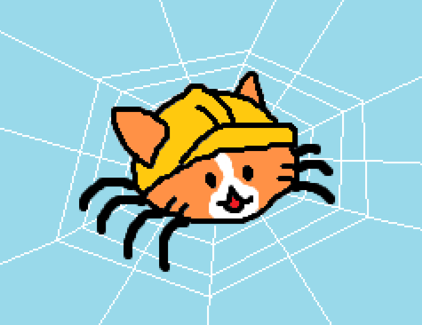

# Indie Web Crawler



The Indie Web is comprised of personal websites linked together with "buttons". Like the Wikipedia Game, this web crawler will traverse through the connections between these personal websites. Can you find the path that the crawler took to get from one web page to another? 

Alternatively, you could just use this crawler to generate a random person's web page and check out the cool stuff they're working on. This crawler is specifically designed to start at Neocities' browse page, but entering a personal website could also work.

## Usage

In the terminal, open this folder (./crawler) and type the following command,

```bash
node index.js [URL] [depth] [seeReport (y/n)] [seeDebug (y/n)]
```

| | |
|---|---|
|URL (default: https://neocities.org/browse) | The URL you want to start the crawler at.|
|depth (default: 1) | An integer that tells the crawler the farthest it can go.|
|seeReport (default: n) | Report displays the amount of times the hyperlinks were found in each page. "n" hides the report.|
|seeDebug (default: n) | Debug messages displays what pages are being visited and whether there was an error. "n" hides the debug messages.|